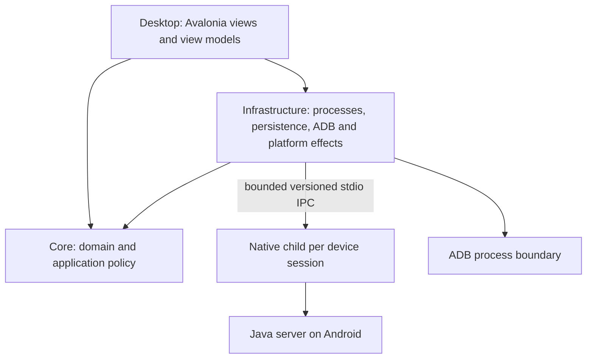

# Seamless 2.0 target architecture

Status: accepted direction, **not an implemented architecture**. Phase 0 freezes
and characterizes the 1.x baseline; implementation starts only in the owning
Phase after owner acceptance. See the [execution plan](../exec-plans/active/seamless-2.md),
[current baseline](SEAMLESS_1_BASELINE.md) and [risk register](SEAMLESS_2_RISK_REGISTER.md).

The owner adopted `SCRCPY_SEAMLESS_2_MASTER_PROMPT.md` on 2026-09-23. Its complete
input SHA-256 is `fcf6f46017b943535d24f2aad60980b484951c1f42a2ed8b5c1f51dbbd82068e`.
This document records the architecture decisions and boundaries; operational
rules remain in the existing [development policies](../development/README.md).
No framework selection, dependency upgrade or production migration is performed
by this documentation change.

## Product and fixed decisions

Correctness, explicit ownership/lifetime, maintainability, automated validation,
safe concurrency, clear sources of truth, privacy, performance and low accidental
complexity are the priorities, in that order. Preserve the product name
**scrcpy Seamless** and Apache-2.0 attribution. An independently maintained fork
may deliberately diverge from upstream architecture; upstream is a source of
reviewed fixes and capabilities, not a mandatory architecture template.

| Boundary | Accepted direction | Adoption gate |
| --- | --- | --- |
| Desktop | C#, .NET 10 LTS, stable Avalonia 12.x, FluentTheme plus small project design system | Exact stable SDK/packages rechecked and pinned in Phase 2 |
| Native runtime | C, SDL/FFmpeg, one child process per active device session | Keep Meson/Ninja; do not mix compiler migration with lifetime rewrite |
| Android server | Java, Gradle | Source-build foundation in Phase 2; no aesthetic Kotlin migration |
| Distribution | Windows x64, portable-first, self-contained .NET | No .NET installation required for users; no new-platform support claim |
| Repository | One monorepo; stable main and seamless-2.0 integration | Short-lived local/work branches and reviewable Conventional Commits |
| Rendering | Separate native mirror window in 2.0 | Embedded rendering and Native AOT are later measured investigations |

Planning-date version observations are not current version pins. Do not install
prerelease frameworks or re-run framework selection without a concrete blocker.
CommunityToolkit.Mvvm is optional after compatibility/license review; do not
create a custom MVVM framework or service locator.

## Boundaries and dependency direction



Desktop selects concrete infrastructure at an explicit composition root;
ViewModels depend on application abstractions, not process/persistence policy.
Use constructor injection; a DI container is optional. Core must not depend on
Avalonia, Win32, System.Diagnostics.Process, concrete storage, concrete ADB or
IPC transports. Infrastructure implements the Core boundaries.

Target paths are approximately `src/desktop/{ScrcpySeamless.Core,
ScrcpySeamless.Infrastructure,ScrcpySeamless.Desktop}`, `src/native`,
`src/server`, `spec/{product,options,ipc,device-protocol}`, layered `tests/`,
`tools/` and structured `docs/`. Move code only when its owning Phase needs it;
move/split scoped AGENTS with the code. No bulk directory move is authorized.

## Identity, configuration and effects

Use distinct typed profile, device, USB, mDNS, endpoint, session and connection
attempt identities. ProfileId is stable independently of current transport or
ADB serial. Treat external serials as opaque where no protocol rule demands
validation. Endpoints support hostname, IPv4, IPv6 and port; colon splitting is
not a valid parser.

Keep saved identity, availability, pairing endpoint, connection endpoint, alias,
preferences and policy separate. Represent connection policy as a ConnectionPlan
rather than unrelated booleans. v2 configuration uses typed System.Text.Json,
explicit schema/version and source-generated metadata when useful.

Migration from `app/phone.json` and `app/scrcpy-settings.json` is automatic,
idempotent, fixture-tested, validated, atomic and interruptible with recovery
backup. Preserve recoverable v1 data until validation succeeds. Portable data
belongs under `<application>/data/`; installed data under
`%LOCALAPPDATA%\scrcpy-seamless\`, behind a path abstraction. A package marker
may select portable behavior after design review.

Use short persistence critical sections and snapshot/revision/CAS semantics.
Never hold a config lock across process launch, ADB, network I/O or callbacks.
Async I/O takes owned cancellation tokens; no unowned fire-and-forget work or
UI-thread blocking. Avoid async void except UI event adapters.

ADB uses ProcessStartInfo.ArgumentList and UseShellExecute=false. Separate
validation from argument encoding. Sanitize and test stdout/stderr for authorized,
unauthorized/offline/multiple devices, unusual serials, mDNS, IPv4/IPv6/hostname,
daemon messages, malformed input, cancellation and timeout. Pairing codes remain
ephemeral and are redacted from all errors/diagnostics.

## Application activation and process ownership

One same-user Desktop control center can own multiple concurrent device sessions,
each with one native child. Repeated activation uses a restricted same-user
channel, preferably a CurrentUserOnly named pipe on Windows, not window-title
searches. Graceful typed Stop precedes an owned Job Object or equivalent
parent-death safety net. Never kill unrelated processes by executable name.

Within one device session, failover preserves native PID and mirror HWND. Native
application lifetime survives replacement connection generations. Parent IPC EOF
has an explicit termination policy; a child must not outlive its owner forever.

## Desktop/native machine contract — Phase 6

Initial transport: redirected stdin for commands; stdout only for framed machine
responses/events; stderr for human logs. Drain stdout and stderr concurrently.
Use a 4-byte unsigned little-endian length followed by UTF-8 JSON. Default maximum
payload target is 1 MiB, with bounded allocations and explicit malformed-input
handling. Select and pin a mature permissively licensed C JSON library after
review; do not build a fragile private JSON parser.

Handshake includes product identity, protocolMajor/minor and capabilities.
Messages carry messageType, requestId where applicable, sessionId and
connectionAttemptId. Lifecycle machine events also carry a per-process sequence
number, UTC timestamp, monotonic process timestamp, subsystem, event type and
typed reason/error. Their ordering is deterministic within the machine stream;
cross-process correlation uses identities and protocol order rather than UTC
alone. Critical lifecycle events flush immediately. Major
mismatch fails explicitly, same-major unknown optional fields are ignored and
unknown message types have a specified policy. Share golden frames/contract tests
across C# and C.

Minimum commands: Stop and FocusWindow. Minimum events: NativeReady, Connecting,
StreamStarted, TransportLost, ReconnectScheduled, Reconnecting, StreamResumed,
CapabilityDegraded, SessionStopped and FatalError. HWND polling and private
SCRCPY_RECONNECT_SERIAL/SCRCPY_STOP_EVENT variables cease to be canonical lifecycle
contracts. A narrowly scoped LegacyNativeAdapter may bridge Phase 5 without
leaking those contracts into Core/ViewModels.

## Native application and connection lifetimes — Phases 7–8

```text
sc_app
  application-lifetime main-thread dispatcher
  presentation: window, renderer, texture and retained frame
  input_router: current control endpoint or none
  connection_manager: policy and attempt ownership
  current_session -> sc_session (one connection generation)
                       server, transport/channels, video, audio,
                       controller, recorder and owned workers
```

Replace cross-session restart orchestration with explicit create/init, start,
request-stop, join and destroy boundaries. Local goto cleanup remains valid C.
Stop and join producers before destroying resources they can access. Document
nontrivial synchronization and lock ordering.

Presentation must not own a session controller. Detach input on disconnect, retain
the last valid frame and keep the SDL event loop responsive. Rebind only to valid
current-session control state; first valid replacement stream/frame confirms
visual recovery, and capture restoration is explicit. FrameBuffer internals are
encapsulated behind reset/drain/ownership APIs.

The dispatcher lives for the application and is not stopped/resumed per session.
Every session callback carries generation identity; stale queued work is rejected
before touching a replacement session. Test disconnect/teardown/close boundaries,
late callbacks, cancellation and rapid reconnect deterministically.

ConnectionManager owns candidates, priorities, retry classification, backoff,
budgets, hysteresis, failover and capability policy. TransportResolver owns USB,
TCP/IP, mDNS refresh and normalization. Server code receives a resolved target;
it does not decide failover policy. Failures distinguish user/window stop,
transport loss, transient connect, server start, invalid configuration, protocol,
decoder/controller fatal, time limit and application shutdown. Do not retry every
failure indefinitely.

Default behavior remains USB first, then Wi-Fi on USB loss. Future failback/USB
return/endpoint change/wireless outage must fit the model, but do not enable
flapping automatic failback without hysteresis.

Target reconnect semantics intentionally improve 1.x restrictions:

- finalize recording segments and continue deterministic part01/part02 files;
- use an overall wall-clock session deadline, including reconnect time, unless
  a later explicit product decision changes it;
- support meaningful headless/no-window modes;
- represent lost transport capabilities as CapabilityDegraded when media can
  safely continue;
- permit move/resize/close/Stop during reconnect and cancellation during teardown.

## Options and Android protocol

Phase 4 owns `spec/options/options.yaml`, schema and SpecGen. Canonical basic
metadata includes names/aliases, type/shape/default, enum/range, category/help ID,
CLI form, availability, requires/conflicts, deprecation and UI hints. Generate or
parity-check C#/native/UI/docs metadata with CI drift detection. Generated output
identifies its source. Complex compatibility stays typed code with named RuleIds;
YAML must not become a programming language. Native remains the final authority
for actual device capabilities.

Audit client/server channels, ownership, message IDs, byte order, lengths, error
behavior and negotiation under `spec/device-protocol`. Add C-to-Java and
Java-to-C golden vectors and malformed/truncated/oversized coverage. Prefer small
auditable serialization over generation for its own sake. Preserve Java capture,
encoding, audio, control, device-service and transport boundaries; refactor only
when a demonstrated architecture/lifetime issue warrants it. Client/server
incompatibility fails explicitly.

## UI, accessibility and localization

Desktop converges on Devices, Sessions, Profiles, Settings and Diagnostics with
guided first-run setup. Device cards expose identity/alias, transport availability,
fallback readiness, profile and primary Mirror action. Reconnect is an explicit
sequence with separate video/audio/control readiness; partial recovery is not full
success. Prefer a coherent control center over independent floating control panes.

FluentTheme is the base; project tokens cover type, spacing, radii, surfaces,
borders, semantic status, focus, icon size and motion. Reusable controls should
solve repeated UI needs rather than create a private framework. Use compiled
bindings/x:DataType where statically knowable; stable AutomationIds, keyboard and
screen-reader semantics, system/light/dark, high-DPI/multi-monitor and non-color
status cues.

2.0 ships English with resource-based localization readiness. Core emits semantic
codes and structured parameters, not translated UI strings. Machine data, option
IDs, protocol, persistence and machine logs use invariant formats. Format UI data
for culture, tolerate text expansion, and consider pseudo-localized tests. A small
resource-change notification boundary supports later runtime switching. The
actual language selector/translations belong to 3.0, not unfinished 2.0 UI.

## Validation, security and diagnostics

Layer xUnit Core/Infrastructure tests, Avalonia.Headless, focused visual regression
and Windows E2E/accessibility coverage (Appium or then-current supported approach).
Selectors use stable semantic IDs, not translated labels or tree indexes.

The native harness needs controllable transport/server/video/audio/controller/
clock adapters, model transition assertions, retry budgets and deterministic
teardown. Cover initial/active/teardown disconnects, stale callback/frame/input,
success/failure/cancellation/close, aspect/rotation, 100 cycles and resource growth,
wireless loss, USB return/flapping, recording/headless/deadlines. Arbitrary sleeps
and blind retries do not replace synchronization.

Fuzz/property-test IPC, endpoints, ADB and device/control parsers for lengths,
truncation, overflow, malformed strings/UTF-8/numbers and unknown messages. Add
ASan/UBSan, useful warnings, targeted analysis and TSan only with actionable signal.
Never suppress real failures for green CI. Hardware reports remain a separate
sanitized evidence layer; normal PR CI does not require a phone.

Observability is built with the new architecture: Phase 6 defines the lifecycle
event contract, Phase 7 adds session-generation-aware app/session and worker
start/stop/join/destroy and stale-callback diagnostics, and Phase 8 records
candidate/resolve/connect/retry/failover/failback/degradation decisions. Correlate
TransportLost, ConnectStart, ServerReady, FirstVideoFrame, FirstAudioPacket,
ControlReady and StreamResumed per attempt, including elapsed timings and
separate video/audio/control readiness.

Phase 12 exports local structured JSONL diagnostic bundles with resource and
performance counters, aggregate audio/video/control metrics, log-size/rotation
policy, soak correlation and privacy tests. Audio metrics include packets
received/decoded, samples submitted/dropped, underflow/overflow, queue depth
where applicable, decoder/sink restart and the first packet after reconnect.
Never log every audio sample or video frame: aggregate high-frequency counters
periodically while flushing critical lifecycle events immediately. Bundles
exclude pairing codes, ADB private keys and other secrets; redact unnecessary
raw device/network identifiers. No telemetry or remote web content by default.
Validate paths as data and constrain generated filenames. The legacy Phase 0
observer is not a substitute for this contract.
Add SECURITY.md before public beta. Follow the existing evidence-first debugging
policy and review AGENTS/docs impact for every change.

## Provenance, research and later adoption

Phase 2 pins native/compiler/dependency inputs separately from lifetime changes,
creates .NET nullable/analyzer/central-package foundations and rechecks urgent
stable upstream security/crash/race/correctness/protocol fixes. Phase 9 performs the
broader selective audit. Record baseline and explicit ports with ADOPTED,
NOT_APPLICABLE, SUPERSEDED or DEFERRED decisions, rationale and tests. Unreleased
changes require deliberate urgency review; no wholesale architecture merge.

Competitive audits must identify exact commits, UX, implementation evidence,
license constraints, current Seamless support and ADOPT/ADAPT/ALREADY_BETTER/
DEFER/REJECT decisions. Required candidates from the charter are SimonAKing/scrcpy-gui,
barry-ran/QtScrcpy, viarotel-org/escrcpy, srevinsaju/guiscrcpy,
GeorgeEnglezos/Scrcpy-GUI, Shrey113/Adb-Device-Manager-2 and kil0bit-kb/scrcpy-gui.
These are future audit inputs, not projects whose current licenses were validated
in Phase 0. Distinguish inspiration, independent implementation and copied assets.
Actual reuse needs exact source/version/path/license/copyright/destination/change
records and notices/acknowledgements. GPL/AGPL or proprietary reuse requires an
explicit licensing decision; do not copy it to fill a feature checkbox.

Phase 11 removes legacy PowerShell/VBS, env/HWND contracts, old catalogue, manual
package lists and imported native baseline only after parity. Official releases
then build server/native/Desktop from the exact immutable tagged source with
checksums, license/source obligations, SBOM and supported attestations. Do not
claim reproducibility without measurement. Phase 1 corrected the legacy
publisher's mutable-tag behavior;
remote settings, push/merge/tag/release always need owner authorization.

The initial DocsCheck validates tracked Markdown links and anchors. Later
extensions will validate package paths, config/options/capabilities, license
paths and generated drift; external-link checks should not make normal
PRs depend on third-party uptime. CI already has some safeguards; extend them
from the [observed baseline](SEAMLESS_1_BASELINE.md), not an imagined empty setup.

## Beyond 2.0

Keep boundaries compatible with later runtime localization, embedded rendering,
Linux/macOS, ARM64, automation APIs, extensions/future transports and signed update
channels. Do not implement their speculative frameworks now. Compare Meson/Ninja
against CMake/Ninja (including dependency-management options) only after stable
2.0 using measured setup/build/test/tooling/platform/maintenance evidence. Do not
maintain two build systems indefinitely. Benchmark AOT only after Desktop is
stable and adopt it only when benefits outweigh trimming/reflection complexity.
